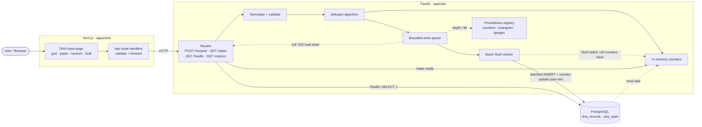
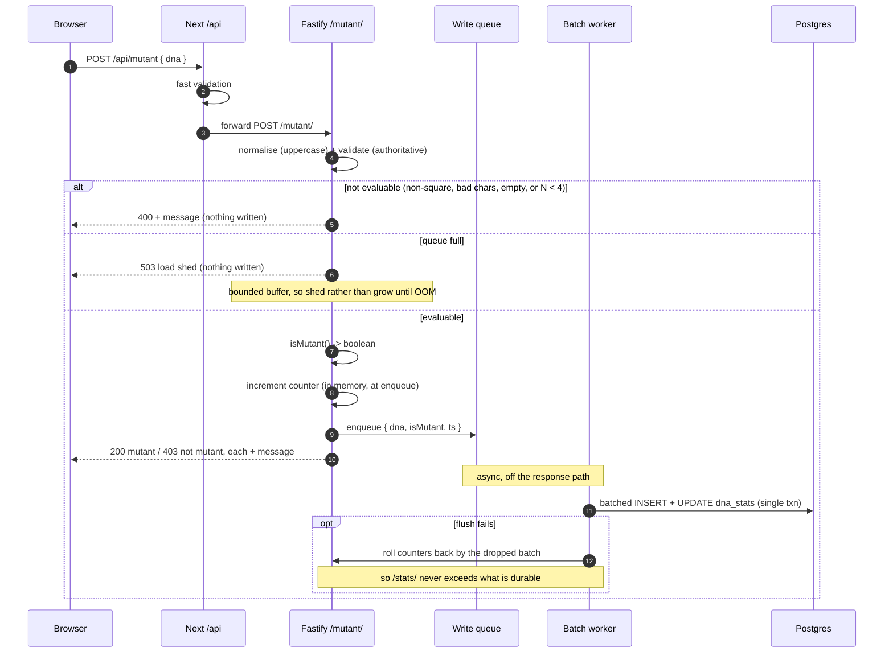
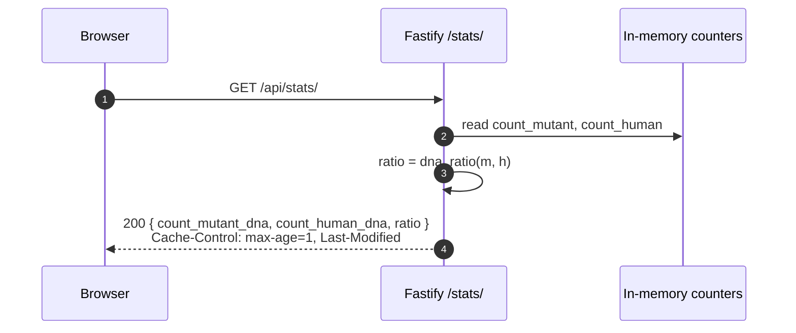
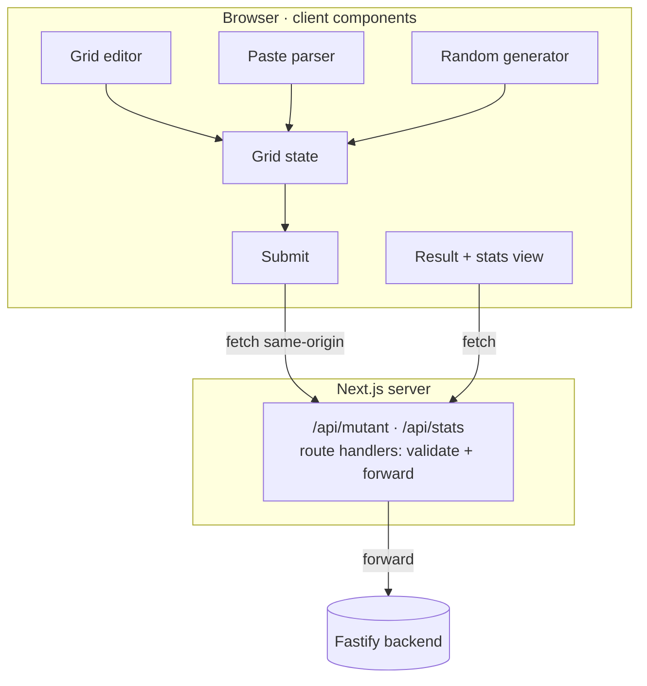
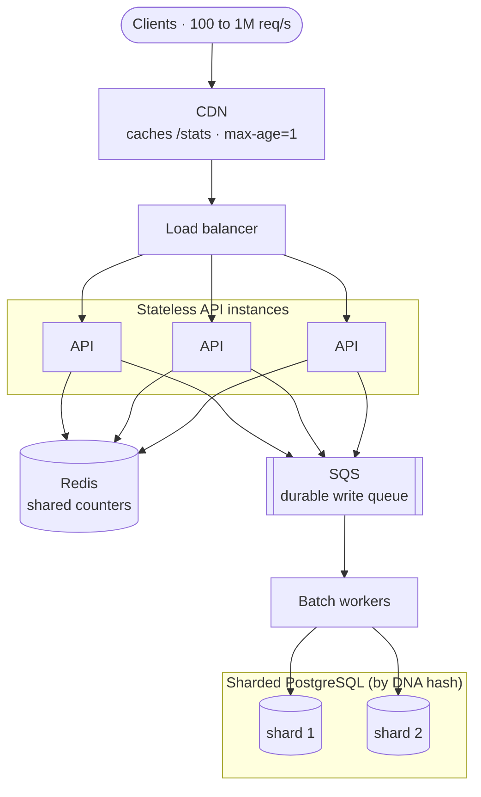

# Architecture

Architecture for the RIF mutant detector. Decisions and reasoning live in the
[README development log](README.md#development-log); this document is the visual
reference. Diagrams are Mermaid, so they render on GitHub and stay in version
control.

- [System overview (local)](#system-overview-local)
- [Request flow: POST /mutant/](#request-flow-post-mutant)
- [Request flow: GET /stats/](#request-flow-get-stats)
- [Next.js layers](#nextjs-layers)
- [Scaled topology (documented, not built)](#scaled-topology-documented-not-built)

---

## System overview (local)

Three components run locally: the Next.js frontend, the Fastify API, and
PostgreSQL. Writes are decoupled from the response path by an in-process queue;
stats are served from in-memory counters that are checkpointed to the database.

Notes the diagram cannot show:

- **`/health` checks its dependency.** It runs `SELECT 1` against Postgres with a
  short timeout and answers `503` when the database is unreachable, rather than
  reporting healthy because the process happens to be alive.
- **The queue is bounded.** When it fills, `POST /mutant/` sheds load with `503`
  instead of buffering until the process dies.
- **A failed flush rolls the counters back**, so `/stats/` never reports more
  than is durably stored.

---

## Request flow: POST /mutant/

Validation is authoritative in Fastify. The response returns as soon as the
result is computed and the record is enqueued; the durable write happens
asynchronously in batches, off the response path.

---

## Request flow: GET /stats/

Served entirely from in-memory counters, so it never scans the records table.
Freshness is communicated through HTTP headers, keeping the body to the spec's
exact three fields.

---

## Next.js layers

The three input modes converge on one grid state before submission. The browser
only ever talks to same-origin `/api/*` route handlers, which validate and
forward to the Fastify backend.

---

## Scaled topology (documented, not built)

How the same design reaches the top of the 100 to 1M req/s range. The app tier
scales horizontally behind a load balancer; the data tier scales separately via
a durable queue, batching, and sharding. Stats reads are absorbed by a CDN and
shared counters in Redis.

