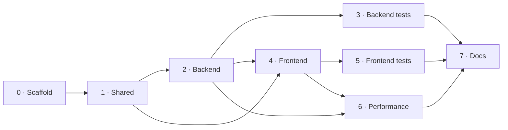

# Build Plan

The plan for building the RIF mutant detector, now that design is settled. It is
organised into phases with explicit **agent delegation**. Per the working model
in [CLAUDE.md](CLAUDE.md), the main agent coordinates and keeps the dev log; each
build task is delegated to the sub-agent named below.

**Design references:** [README dev log](README.md#development-log) (decisions),
[ARCHITECTURE.md](ARCHITECTURE.md) (diagrams).

**Agents:** `fastify-api`, `nextjs-frontend`, `test-author`, `performance`.
UX/UI via the `frontend-design` / `ui-ux-pro-max` skills; review via the existing
`code-reviewer` / `setup-code-review` hook.

Each phase should end with a Conventional Commit and, where there is runtime
behaviour, the `verify` skill.

---

## Phase 0 — Scaffold and tooling  ·  main agent

- Turborepo monorepo: `apps/api`, `apps/web`, `packages/shared`.
- pnpm workspaces (via corepack), `turbo.json` with `dev` / `build` / `test` /
  `lint` pipelines.
- Shared TypeScript config, ESLint, Vitest at the root.
- `.env.example` with all variables (see [Repository and setup](README.md#repository-and-setup)).
- Root scripts: `dev`, `build`, `test`, `lint`, `db:setup`.

**Depends on:** nothing. **Deliverable:** `pnpm install && pnpm dev` boots empty
apps.

## Phase 1 — Shared contract  ·  `fastify-api` (with `packages/shared`)

- Request/response types (`MutantRequest`, `StatsResponse`, error shape).
- Light validation helpers (alphabet, square, size) reused by API and web.

**Depends on:** Phase 0. **Deliverable:** `packages/shared` consumed by both apps.

## Phase 2 — Backend core  ·  `fastify-api`

- `schema.sql`: `dna_records`, `dna_stats`, `dna_ratio` function, seed row; wired
  to `pnpm db:setup`.
- Data layer with a lightweight client (`postgres.js` / `pg`): batched insert +
  transactional counter update; boot-load counters.
- `isMutant` algorithm (pure, per the pseudocode in the dev log).
- Write queue behind an `enqueue()` / drain interface: bounded buffer,
  backpressure (`503`), batch worker, `SIGTERM` drain.
- Routes: `POST /mutant/` (200/403/400, persist on 200/403), `GET /stats/`
  (cached counters, headers), `GET /health`.
- Cross-cutting: normalise + validate, CORS, helmet, pino logging, error shape.

**Depends on:** Phase 1. **Deliverable:** API passes manual `curl` of all routes.

## Phase 3 — Backend tests  ·  `test-author`

- Unit: algorithm edge cases (example, non-mutant, one-sequence boundary, four
  directions, long run counted once, `N < 4`, validation).
- Integration: 200/403/400, persistence on 200/403 only, `/stats/` counts and
  ratio (including `ratio: 0`).
- Queue: batched flush, backpressure, counter consistency.
- DB isolation (dedicated test DB, rollback/truncate). Report coverage.

**Depends on:** Phase 2. **Deliverable:** backend coverage > 80%.

## Phase 4 — Frontend  ·  `nextjs-frontend` (+ design skills)

- Single page; grid editor, paste parser, random generator over one grid state.
- Client-side validation with clear messages.
- `/api/mutant` and `/api/stats` route handlers: validate + forward to Fastify.
- Result view (mutant / not / error) and optional stats display.
- Theming via `frontend-design` / `ui-ux-pro-max`.

**Depends on:** Phases 1 and 2. **Deliverable:** full flow works against the API.

## Phase 5 — Frontend tests  ·  `test-author`

- Component: Vitest + React Testing Library + happy-dom, MSW mocking `/api`
  (grid, paste, random, validation, result rendering).
- Unit tests for the `/api` route handlers (validate + forward, downstream mocked).
- E2E: 2 to 3 Playwright smokes (happy path + validation error).

**Depends on:** Phase 4. **Deliverable:** frontend coverage contributes to > 80%.

## Phase 6 — Performance and observability  ·  `performance`

- Load scripts (`autocannon` / `k6`) for `/mutant/` and `/stats/`; report
  throughput, latency percentiles, and that backpressure sheds load.
- Basic `/metrics` (a few counters + a latency histogram) as a demonstration.
- Lighthouse on the frontend.

**Depends on:** Phases 2 and 4. **Deliverable:** documented local numbers.

## Phase 7 — Docs and finalise  ·  main agent

- Finalise README "How to Run" and check `.env.example` is complete.
- Confirm [ARCHITECTURE.md](ARCHITECTURE.md) matches the built system.
- Tick the deliverables checklist; final review pass.

**Depends on:** all. **Deliverable:** a reviewer can clone, set up, and run from
the README alone.

---

## Dependency summary

